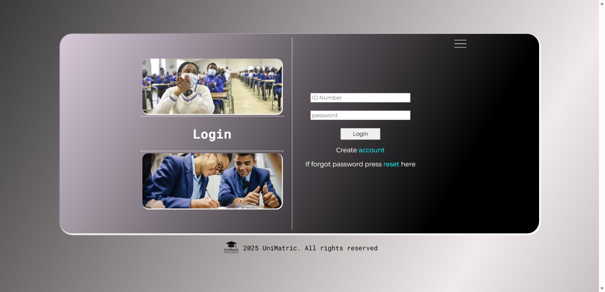

# 🎓 UniMatric

UniMatric is a **full‑stack web application** that helps South African matric learners determine **which university courses they qualify for** based on their subjects and results.

The platform simplifies access to tertiary education information by matching learner results with official university entry requirements.

---

## 🚀 Live Demo

🔗 [https://unimatric.onrender.com](https://unimatric.onrender.com)

---

## 📌 Problem Statement

Many matric learners struggle to understand:

* Which universities they qualify for
* Which courses they can apply for with their results
* Where to find accurate and up‑to‑date entry requirements

UniMatric solves this by providing a **centralised, easy‑to‑use system** that evaluates learner results against university course requirements.

---

## ✨ Features

* Input matric subjects and results
* Automatically match results with university course requirements
* View eligible courses across multiple South African universities
* Access additional university information (location, website, application dates)
* Clean and user‑friendly interface
* Provide university prospectors

## 🖼 Screenshots

### Login Page


### Check Courses


### Universities Information


### About Us


---

## 🛠 Tech Stack

**Frontend**

* HTML
* CSS
* JavaScript
* EJS

**Backend**

* Node.js
* Express.js

**Database**

* PostgreSQL

**Deployment**

* Render

---

## 🗄 Database Design

The PostgreSQL database stores:

###### User Data 
* id_number
* first_name
* last_name
* email_address
* school_name
* user_password


---

## ⚙️ How It Works
1. Users register and log in using their ID number and password
2. Users enter their matric subjects and results
3. Backend validates and processes the input
4. Matching courses are returned and displayed to the user

---

## 🧪 How to Run Locally

```bash
# Clone the repository
git clone https://github.com/washuravele/UniMatric.git

# Navigate into the project
cd UniMatric

# Install dependencies
npm install

# Create a .env file and add your database credentials

# Start the server
node index.js
```

The application will run on:

```
http://localhost:3000
```

---

## 📂 Project Structure

```
UniMatric/
│── data/
│── public/
│── views/
|── screenshots/
│── index.js
│── package.json
|── README.MD
```

---

## 🔮 Future Improvements

* Save learner profiles and results
* Admin dashboard for managing courses and requirements
* API integration for third‑party platforms
* Improved analytics and reporting

---

## 👨‍💻 Author

**Washu Ravele**
Aspiring Software Developer

* GitHub: [https://github.com/washuravele](https://github.com/washuravele)
* LinkedIn: (add your LinkedIn link)

---

## 📄 License

This project is for educational and portfolio purposes.
